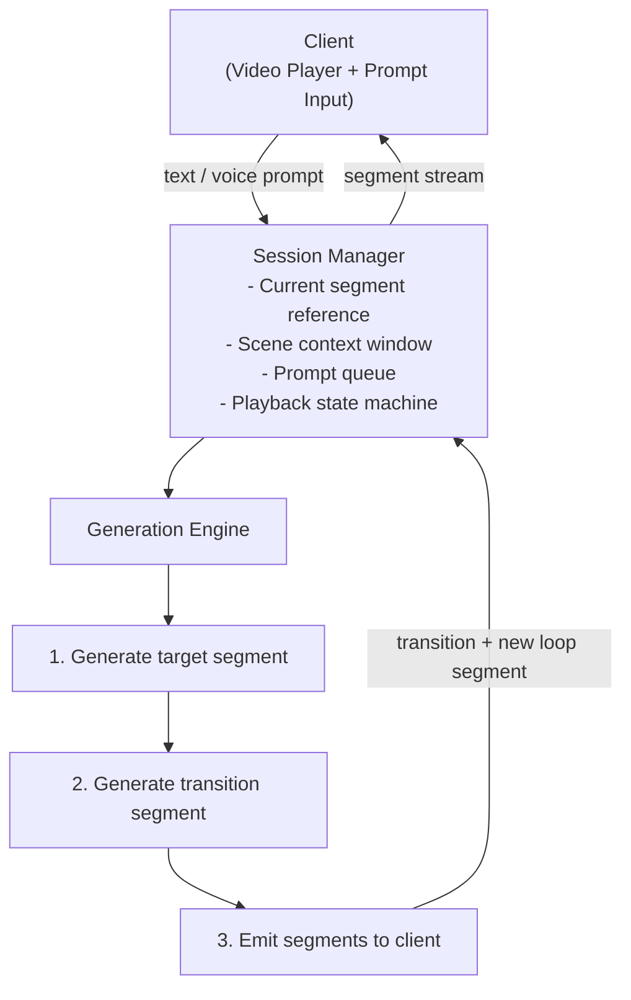
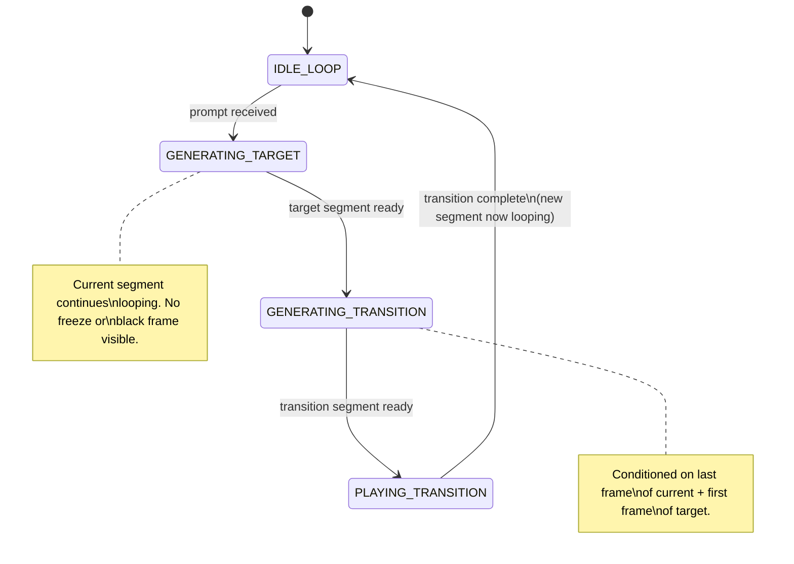
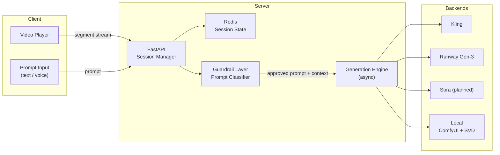
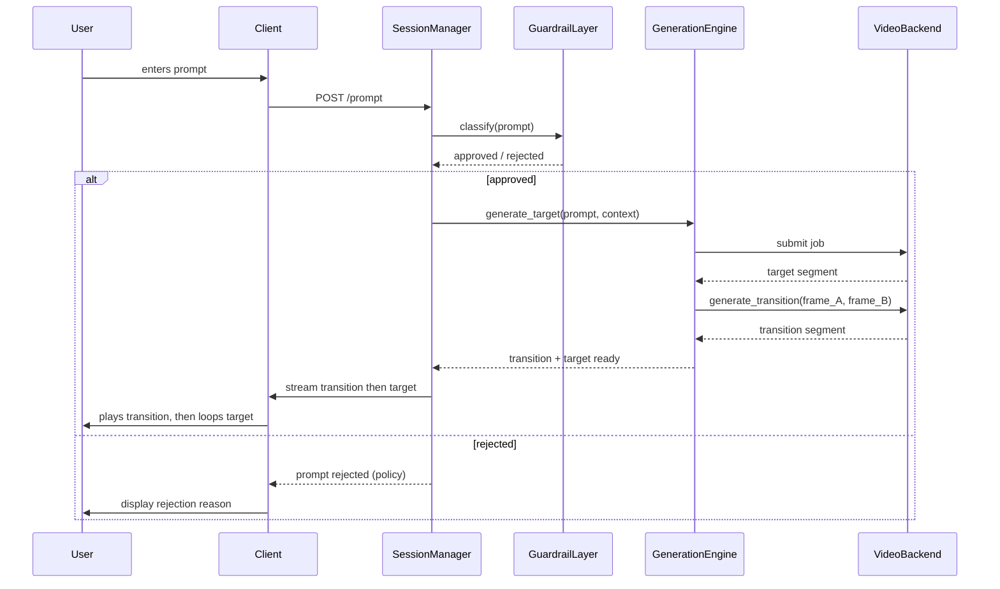

# Architecture

## Overview

InteractiveGen is a pipeline of four loosely coupled stages: Stream, Prompt, Generate, Transition. Each stage is independently replaceable as the underlying video generation ecosystem matures.



## Playback State Machine



## Generation Pipeline

### Step 1 -- Generate Target Segment

On prompt receipt:

1. Enrich the prompt with scene context (current setting, characters, lighting, established continuity)
2. Submit to video generation backend
3. Store resulting segment as `target`

The context window is maintained server-side as a rolling text description of the scene, updated after each accepted prompt. This is passed as conditioning text to the generator to maintain continuity of characters, environment, and tone.

### Step 2 -- Generate Transition

Once `target` is ready:

1. Extract last frame of current looping segment as `frame_A`
2. Extract first frame of `target` as `frame_B`
3. Submit to video generation backend: "generate a smooth visual transition from frame_A to frame_B, maintaining consistent style"
4. Store resulting segment as `transition`

Transition duration implicitly encodes scene distance. A prompt moving within the same room produces a short transition. A prompt crossing settings or time produces a longer one. This is a feature -- it gives the user feedback that a large change is incoming.

### Step 3 -- Emit

1. Signal client to queue transition after current loop boundary
2. Follow transition with target segment in continuous loop
3. Update scene context window with description of new scene

## Component Architecture



## Video Backends

| Backend | Status | Notes |
|---|---|---|
| Kling | Supported | Good temporal consistency, API available |
| Runway Gen-3 | Supported | Strong transition quality |
| Sora | Planned | API access limited at time of writing |
| Local (ComfyUI + SVD) | Experimental | High latency, no API cost |

Backend selection is per-deployment via `config.yaml`. Multiple backends can be configured with fallback ordering.

## Sequence -- Full Prompt Cycle



## Guardrail Layer

- Prompt classification before submission to generator
- Category enforcement configurable per deployment profile
- Age verification gate at session initialisation where required
- Implemented as a lightweight classifier (local model preferred for latency)

## Configuration

All deployment behaviour is controlled via `config.yaml`:

```yaml
backend:
  primary: kling
  fallback: [runway, local]

guardrails:
  profile: default          # default | adult | art_installation
  age_gate: false

session:
  context_window_tokens: 2048
  max_queued_prompts: 5

generation:
  target_duration_seconds: 6
  transition_max_duration_seconds: 4
```
